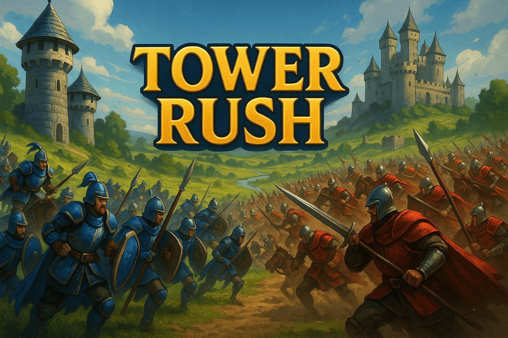

# 🏰 Tower Rush

**Tower Rush** est un jeu de stratégie en temps réel (RTS) médiéval fantastique entièrement jouable dans votre navigateur. Plongez dans des batailles épiques où la tactique et la rapidité déterminent le vainqueur !

## 🎮 Jouez maintenant !

[](https://tower-rush.lol)
[](https://github.com/codespaces/new?hide_repo_select=true&ref=master&repo=gtko/towerRush)
[](https://github.com/gtko/towerRush/releases/latest)

> **🌟 Découvrez un RTS innovant** : Pas de micromanagement fastidieux ! Concentrez-vous sur la stratégie pure avec des mécaniques de jeu accessibles mais profondes.

## ✨ Caractéristiques principales

### 🎯 **Gameplay Unique**
- **🏗️ Construction Automatique** : Vos bâtiments évoluent automatiquement selon leur garnison
- **⚔️ Combat Tactique** : Envoyez vos armées avec précision (10% à 100% de vos forces)
- **🛡️ Bonus Défensif** : 20% de bonus pour les défenseurs - chaque attaque compte !
- **📈 Progression Visuelle** : Regardez vos bâtiments grandir (maison → tour → château)

### 🌐 **Multijoueur Révolutionnaire**
- **👥 Jusqu'à 4 joueurs** en temps réel
- **🔗 WebRTC P2P** : Connexion directe sans serveur
- **💬 Chat intégré** avec noms de profils
- **⚡ Latence minimale** grâce à la technologie peer-to-peer

### 🎨 **Expérience Moderne**
- **📱 Interface Responsive** : Jouez sur PC, tablette ou mobile
- **🎭 Profils Personnalisés** : Créez votre identité avec avatars uniques
- **🏆 Système de Classement** : Suivez vos performances et défiez les autres
- **🎵 Ambiance Immersive** : Graphismes médiévaux et effets sonores

## 🎮 Comment Jouer

### 🎯 **Objectif**
Dominez le champ de bataille en conquérant tous les bâtiments ennemis ! Chaque structure produit automatiquement des unités - plus vous en contrôlez, plus votre armée grandit rapidement.

### ⌨️ **Commandes Intuitives**
| Action | Commande | Description |
|--------|----------|-------------|
| 🏰 **Sélection** | `Clic gauche` | Sélectionner/désélectionner vos bâtiments |
| ⚔️ **Attaque** | `Clic droit` | Envoyer vos unités vers une cible |
| 📊 **Dosage** | `Molette souris` | Ajuster le % d'unités à envoyer (10%-100%) |
| ⏸️ **Pause** | `Espace` | Pause tactique (mode solo uniquement) |

### 📈 **Mécaniques de Jeu**
- **Production Auto** : 1 unité/seconde (2/seconde pour les châteaux)
- **Évolution** : Vos bâtiments se renforcent automatiquement
- **Tactique** : Timing et coordination sont la clé de la victoire
- **Équilibre** : Bonus défensif pour des combats équilibrés

### 🚀 **Démarrage Rapide**
1. **Sélectionnez** vos bâtiments (bordure dorée = sélectionné)
2. **Visez** un bâtiment ennemi et clic droit pour attaquer
3. **Ajustez** la molette pour contrôler vos forces
4. **Répétez** jusqu'à la victoire totale !

## 🛠️ Installation & Développement

### 🎮 **Pour Joueurs**
**Option 1 - Jouer en ligne :**
[](https://tower-rush.lol)

**Option 2 - Télécharger :**
1. [Téléchargez la dernière version](https://github.com/gtko/towerRush/releases/latest)
2. Extrayez le fichier zip
3. Ouvrez `index.html` dans votre navigateur

### 👨‍💻 **Pour Développeurs**

**Option 1 - GitHub Codespaces (Recommandé) :**
[](https://github.com/codespaces/new?hide_repo_select=true&ref=master&repo=gtko/towerRush)

**Option 2 - Installation locale :**
```bash
# Cloner le repository
git clone https://github.com/gtko/towerRush.git
cd towerRush

# Serveur de développement (optionnel, pour le multijoueur)
python3 -m http.server 8000
# ou
npx serve .
```

> **💡 Avantage** : Aucune compilation nécessaire ! Application web pure en JavaScript vanilla.

## 🌐 Mode Multijoueur

### 🚀 **Technologie Révolutionnaire**
Grâce à **WebRTC**, profitez d'une expérience multijoueur **sans serveur** :
- **🔗 Connexion P2P** : Directe entre joueurs
- **⚡ Latence ultra-faible** : Pas d'intermédiaire
- **🛡️ Sécurisé** : Vos données restent entre vous
- **🌍 Universel** : Fonctionne partout dans le monde

### 🎯 **Comment Jouer à Plusieurs**
1. **🏠 L'hôte** crée une partie et obtient un code de salle
2. **👥 Les joueurs** rejoignent avec ce code
3. **💬 Chat** pour se coordonner avant la bataille
4. **⚔️ Bataille épique** jusqu'à 4 joueurs simultanés !

### 🏆 **Modes de Jeu**
- **🤖 Solo vs IA** : Perfectionnez vos tactiques
- **👥 Multijoueur** : Défiez vos amis
- **🏆 Tournois** : Organisez vos propres compétitions

## Structure du Projet

```
tower-rush/
├── index.html          # Page d'accueil
├── game.html           # Interface de jeu
├── style.css           # Styles principaux
├── modern-style.css    # Styles modernes additionnels
├── src/
│   ├── core/
│   │   ├── Game.js     # Logique principale du jeu
│   │   └── LeaderboardManager.js
│   └── multiplayer/
│       └── MultiplayerManager.js
└── assets/             # Sprites et ressources graphiques
    ├── Buildings/
    ├── Factions/
    ├── Decorations/
    └── Terrain/
```

## 🛠️ Technologies de Pointe

| Technologie | Usage | Avantage |
|-------------|-------|----------|
| **🟨 JavaScript Vanilla** | Moteur de jeu | Performance maximale, zéro dépendance |
| **🎨 Canvas API** | Rendu 2D | Animations fluides 60fps |
| **🌐 WebRTC (PeerJS)** | Multijoueur P2P | Connexion directe, latence minimale |
| **💾 LocalStorage** | Profils & scores | Sauvegarde locale instantanée |
| **🚀 GitHub Actions** | CI/CD | Déploiement automatique |
| **⚡ BunnyCDN** | Distribution | Chargement ultra-rapide mondial |

### 🎯 **Pourquoi ces choix ?**
- **⚡ Performance** : JavaScript natif pour une fluidité optimale
- **📱 Compatibilité** : Fonctionne sur tous les navigateurs modernes
- **🔧 Simplicité** : Aucune installation, aucune compilation
- **🌍 Accessibilité** : Disponible instantanément partout

## Développement

Pour contribuer au projet :

1. Forkez le repository
2. Créez une branche pour votre fonctionnalité (`git checkout -b feature/ma-fonctionnalite`)
3. Committez vos changements en utilisant les [Conventional Commits](https://www.conventionalcommits.org/fr/v1.0.0/)
4. Poussez vers la branche (`git push origin feature/ma-fonctionnalite`)
5. Ouvrez une Pull Request

### Format des commits

Ce projet utilise [Conventional Commits](https://www.conventionalcommits.org/fr/v1.0.0/) pour automatiser les releases :

- `feat:` - Nouvelle fonctionnalité (version mineure)
- `fix:` - Correction de bug (version patch)
- `docs:` - Documentation uniquement
- `style:` - Changements de formatage
- `refactor:` - Refactoring du code
- `perf:` - Amélioration des performances
- `test:` - Ajout ou modification de tests
- `chore:` - Maintenance

Exemples :
```bash
feat: ajouter le mode multijoueur
fix: corriger le bug d'affichage des unités
docs: mettre à jour le README
```

### Releases automatiques

Les releases sont automatiquement créées après chaque déploiement réussi sur `master`. Le versioning suit les [Conventional Commits](https://www.conventionalcommits.org/fr/v1.0.0/) :

- `feat:` → Version mineure (v1.1.0)
- `fix:`, `docs:`, `style:`, etc. → Version patch (v1.0.1)  
- `feat!` ou `BREAKING CHANGE` → Version majeure (v2.0.0)

## Déploiement et Releases

### 🚀 Workflow automatique

Le projet utilise un workflow automatique intégré :

1. **Push sur master** → **Déploiement BunnyCDN** (avec compression zip)
2. **Déploiement réussi** → **Release automatique** (basée sur conventional commits)
3. **Release créée** avec fichiers zip téléchargeables et changelog

### 📦 Téléchargement

- **Latest Release** : [Télécharger la dernière version](https://github.com/gtko/towerRush/releases/latest)
- **Fichiers disponibles** :
  - `tower-rush-v1.x.x.zip` : Version complète avec numéro de version
  - `tower-rush-game.zip` : Version générique

### 🌐 GitHub Pages

Le jeu est automatiquement déployé sur GitHub Pages à chaque push sur la branche principale.

### ⚡ BunnyCDN (Déploiement optimisé)

Le déploiement BunnyCDN utilise maintenant la compression pour optimiser les transferts :

1. **Configurer les secrets GitHub** :
   ```bash
   # Rendre le script exécutable
   chmod +x setup-bunny-secrets.sh
   
   # Exécuter le script de configuration
   ./setup-bunny-secrets.sh
   ```

2. **Informations requises** :
   - Nom de votre Storage Zone BunnyCDN
   - Mot de passe FTP/API de votre Storage Zone
   - Région de votre Storage Zone (Europe, US, Asia)
   - Clé API BunnyCDN (dans Account Settings)
   - ID de votre Pull Zone

3. **Processus de déploiement** :
   - Création d'un package zip avec tous les fichiers
   - Tentative d'extraction sur serveur (avec fallback)
   - Purge automatique du cache CDN
   - Notifications de succès/échec

4. **Déclenchement** :
   - **Automatique** : À chaque push sur `main` ou `master`
   - **Manuel** : Via GitHub Actions → Deploy to BunnyCDN → Run workflow

### 🔧 Configuration manuelle des secrets

Si vous préférez configurer manuellement, ajoutez ces secrets dans Settings → Secrets → Actions :

- `BUNNY_STORAGE_ZONE` : Nom de votre storage zone
- `BUNNY_STORAGE_PASSWORD` : Mot de passe FTP/API
- `BUNNY_STORAGE_ENDPOINT` : storage, ny.storage, la.storage, etc.
- `BUNNY_API_KEY` : Votre clé API BunnyCDN
- `BUNNY_PULL_ZONE_ID` : ID de votre pull zone

### 📋 Monitoring des déploiements

- **Actions** : Surveillez les workflows dans l'onglet Actions
- **Releases** : Consultez l'historique des versions dans Releases
- **Logs** : Vérifiez les logs de déploiement pour diagnostiquer les problèmes

## 📊 Statistiques du Projet


## 🤝 Communauté & Support

### 💬 **Rejoignez-nous**
- **🐛 Bugs & Suggestions** : [Issues GitHub](https://github.com/gtko/towerRush/issues)
- **💡 Idées & Features** : [Discussions GitHub](https://github.com/gtko/towerRush/discussions)
- **🔧 Développement** : [Codespace en 1 clic](https://github.com/codespaces/new?hide_repo_select=true&ref=master&repo=gtko/towerRush)

### 🏆 **Contribuer**
Tower Rush est **open source** ! Vos contributions sont les bienvenues :
- **🎨 Assets graphiques** : Nouvelles unités, bâtiments, terrains
- **🎵 Audio** : Musiques, effets sonores
- **💻 Code** : Nouvelles fonctionnalités, optimisations
- **📚 Documentation** : Tutoriels, guides, traductions

## 📄 License

Ce projet est sous licence **MIT** - voir le fichier [LICENSE](LICENSE) pour plus de détails.

---

<div align="center">

### 🎮 **Prêt pour la bataille ?**

[](https://tower-rush.lol)

*Fait avec ❤️ pour la communauté des joueurs RTS*

**⭐ N'oubliez pas de donner une étoile si vous aimez le projet ! ⭐**

</div>